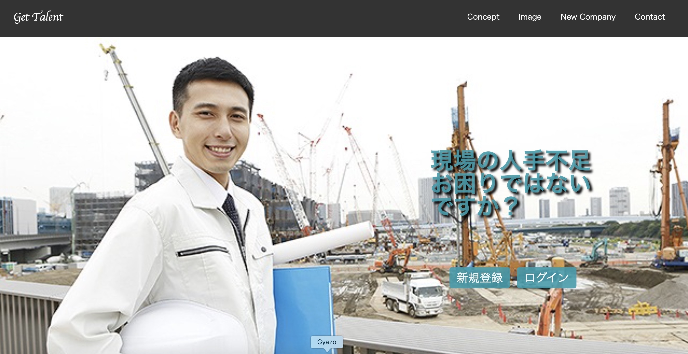

# README

This README would normally document whatever steps are necessary to get the
application up and running.

Things you may want to cover:

* Ruby version

* System dependencies

* Configuration

* Database creation

* Database initialization

* How to run the test suite

* Services (job queues, cache servers, search engines, etc.)

* Deployment instructions

* ...

# newRead

# 概要  

企業間の認知のための共通のプラットフォーム（アプリケーション）   

# アプリケーション名  

Get Talent 

# 制作背景

①前職の環境から建築業界では人手不足が深刻化しており、作業工程の遅れが課題として取り上げられていた 

②労働者確保のために、現状で認知されていない企業を減らす事で企業間の出会いを促進させ、人手不足を緩和出来ないかと考えた 

③中小企業・零細企業の場合、ホームページを所有していなかったりとPR活動に対して疎い傾向が強い。又、ホームページを所有していても認知されていないケースも多い　⇨　元請け・下請け共通のプラットフォームを制作しPR活動のサポートが必要ではないか 

④エンジニアという職業に興味を抱いた経緯に、他業種に対して等しくソリューションを提供できるという視点があり、自分なりに分析・設計・開発を通して実行してみたかったため 

# 実装機能 

①ユーザー登録 

②会社登録（編集・削除可能） 

③詳細機能 

④コメント投稿 

⑤仕事依頼（実装中） 

# 開発環境

RUby/RubyonRails/Javascript/HTML/CSS/Github/Visual Studio Code

# デモ動画

# 使い方

# Get Talent DB設計

## commentsテーブル

|Column|Type|Options|
|------|----|-------|
|user_id|integer|null: false, foreign_key: true|
|job_id|integer|null: false, foreign_key: true|
|text|string|

### Association
- belongs_to :job
- belongs_to :user

## usersテーブル
|Column|Type|Options|
|------|----|-------|
|name|string|null: false|
|email|string|null: false|
|password|string|null: false|

### Association
- has_many :jobs
- has_many :comments
- has_many :requests

## jobsテーブル

|Column|Type|Options|
|------|----|-------|
|name|string|null: false|
|occupation|string|null: false|
|text|text|null: false|
|image|text|null: false|
|region|string|null: false|
|user_id|integer|null: false, foreign_key: true|

### Association
- has_many :comments
- belongs_to :user

## requestsテーブル

|Column|Type|Options|
|------|----|-------|
|name|string|null: false|
|image|text|
|text|text|null: false|
|user_id|integer|null: false, foreign_key: true|

### Association
- belongs_to :user

